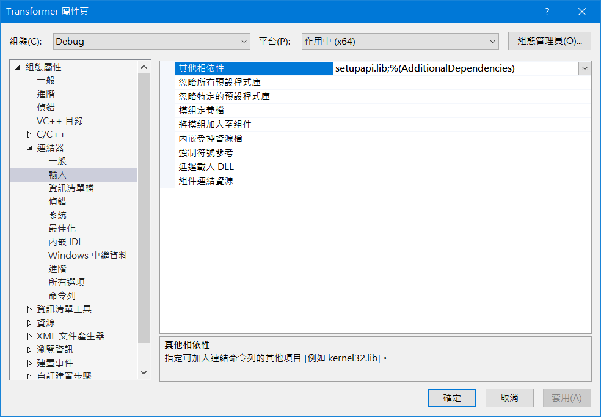
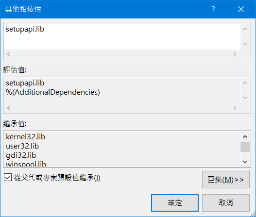

# USB-Information
Get USB information PID and VID.
從磁碟代號中去找尋 USB PID 和 VID 資訊。

## environment
Visual Studio C++ 2019

## usb_information.c
搜尋所有磁碟代號後取得 USB all information.
Get USB all information after searching all disk codes.

## usb_information_2.c
以磁碟代號為搜尋 key 取得 USB all information.
Use the disk code as the search key to obtain USB all information.

## Visual Studio C++ 2019 Project property settings
需要使用外部 "setupapi.lib" 需要設定專案屬性。
Need to use external "setupapi.lib" Need to set project properties.

<table width="100%" align="center" border="0">    
    <tr>
      <td width="30%" align="center"></td>
      <td width="30%" align="center"></td>      
    </tr>    
</table>
